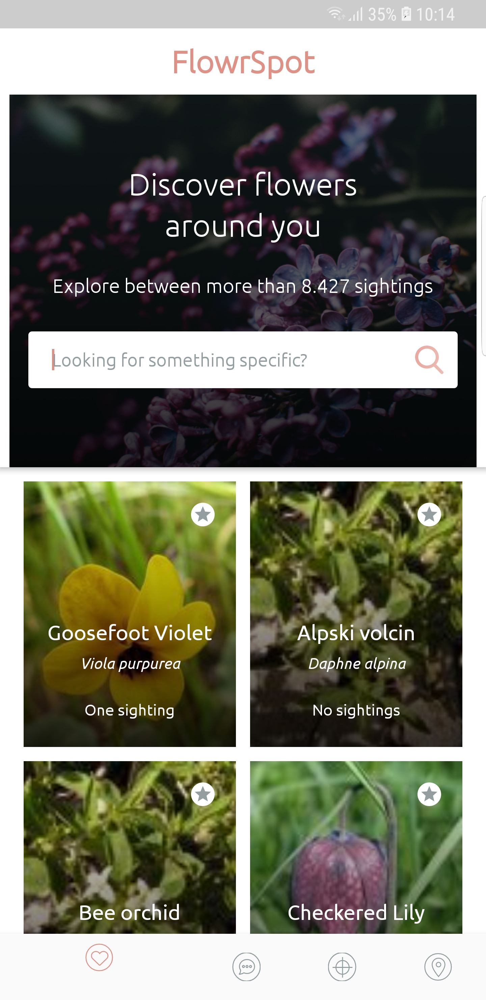
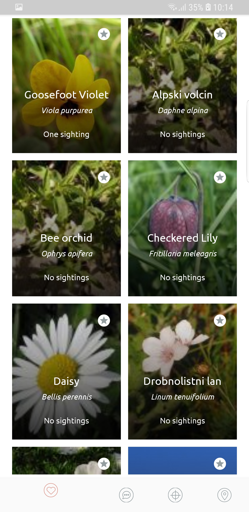
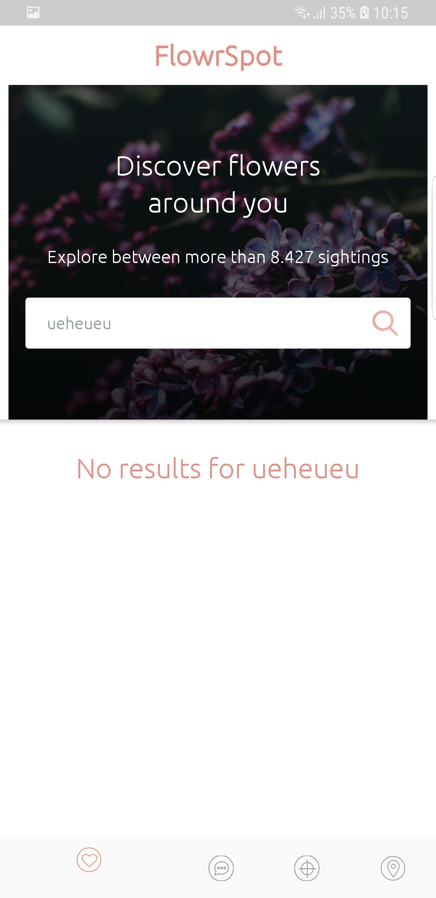

# Povio Test Project

Povio test project.
Min sdk version is 21 (Lolipop)
Main programming language Kotlin.

App consists of only one activity which hosts bottom navigation,
and every screen is implemented as as seperate fragment. The app uses
Coordinator layout to support search area scroll and toolbar hiding.
It also uses Constraint layout for all of it's view's.

This project is based on the latest Android Arhitecture Paging sample.
It uses Room database as a single source of truth, and then when and if
needed uses Paging library to download more pages from the server.

### Libraries
* [Kotlin] For kotlin language support
* [Android Support Library][support-lib]
* [Android Architecture Components][arch]
   * Room [datbase layer]
   * LiveData [communication between layers]
   * Pagin [for paging from server]
* [Android Data Binding][data-binding]
* [Dagger 2][dagger2] for dependency injection
* [Retrofit][retrofit] for REST api communication
* [Glide][glide] for image loading
* [Timber][timber] for logging
* [espresso][espresso] for UI tests
* [mockito][mockito] for mocking in tests

